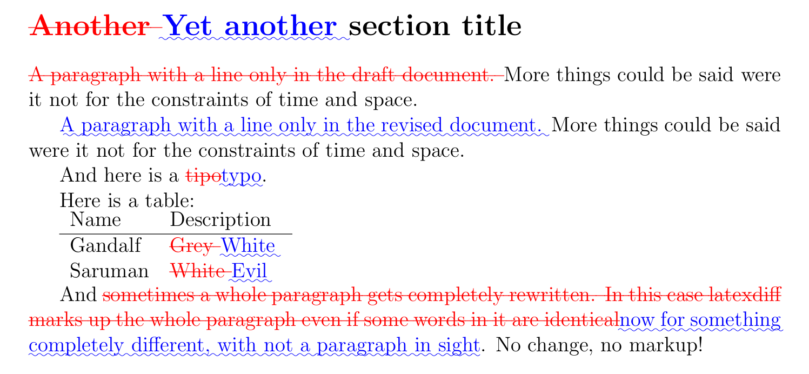

title: Using Git and latexdiff
tags: git, latex, linux
summary: If you use [git](http://git-scm.com/) to manage your [LaTeX](http://www.latex-project.org/) documents, then you can easily integrate [latexdiff](http://www.ctan.org/tex-archive/support/latexdiff) to produce a PDF of the differences. Here are setup instructions.

If you use [git](http://git-scm.com/) to manage your [LaTeX](http://www.latex-project.org/) documents, then you can see the differences in many ways.
You can display word by word changes made in a form that looks like this:

<pre>
<span style="color:teal;">@@ -3045,12 +3045,15 @@</span> \section{Proof of Proposition~\ref{ppnCLTFirstHitShort}}
We finally define the function $g$ <span style="color:red;">that appears</span><span style="color:green;">appearing</span> in Property (6)<span style="color:red;">.
For</span><span style="color:green;">for</span> $x = (q,\xi) \in \CM$, <span style="color:red;">let</span><span style="color:green;">by setting</span> $g((q,\xi)) = \xi \in \mathbb{Z}^2$.
</pre>

Or inspect changes line by line:
```
diff --git a/refs.bib b/refs.bib
index 349c0c3..65b8321 100644
--- a/refs.bib
+++ b/refs.bib
@@ -5556,7 +5585,7 @@
   pages                = {2636--2647}
 }

-@Book{           Rozovski90,
+@Book{           Rozovskii90,
   author       = {Rozovski{\u\i}, B. L.},
   title        = {Stochastic evolution systems},
   series       = {Mathematics and its Applications (Soviet Series)},
```

Or as a compiled PDF using [latexdiff](http://www.ctan.org/tex-archive/support/latexdiff):



Here's how to achieve the above.
Edit `~/.gitconfig` and add the following:

    [alias]
        wdiff = diff --color-words --ignore-all-space
        ldiff = difftool -y -t latex

    [difftool.latex]
        cmd = latexdiff "$LOCAL" "$REMOTE"

Now typing

    git ldiff HEAD~1 > diff.tex

runs [latexdiff] and puts the differences in `diff.tex`.
Tex this as usual to get your PDF.

Alternately for a quick inspection of the differences at the TeX level, use `git wdiff HEAD~1` for word diffs, or `git diff HEAD~1` for line diffs.
You can pipe the output to [aha](http://ziz.delphigl.com/tool_aha.php) to make an html to share if you need to.

## Skipping non-tex files.

The above solution might choke if you try and compare two non-TeX files (e.g. when a figure has changed between revisions).
It also will be problematic if more than one tex file has changed.
If the files are all independent, then you can solve both these problems easily.
Put the following in `~/.gitconfig`:

    [alias]
        wdiff = diff --color-words --ignore-all-space
        ldiff = difftool -y -t latex

    [difftool.latex]
        cmd = ldiff "$LOCAL" "$REMOTE" "$MERGED"

Next create an executable file `ldiff` somewhere in your path with the following:

``` shell
# Make sure inputs are tex files
LOCAL="$1"
REMOTE="$2"
MERGED="$3"

if [[ "${MERGED##*.}" == tex ]]; then
    output="${MERGED%.tex}-diff.tex"

    if [[ -f "$output" ]]; then 
        read -p "File $output exists. Overwrite? " confirm
        [[ "$confirm" != y && "$confirm" != yes ]] && exit 1
    fi

    latexdiff "$LOCAL" "$REMOTE" > "$output"
    echo "Generated $output"
else
    echo "Skipped $MERGED (non tex)."
fi
```

Now running

    git ldiff HEAD~1

will produce a `-diff.tex` file for every TeX file that changed, and do nothing for other files.
You can compile them all in one shot with [latexmk](http://www.ctan.org/pkg/latexmk/).

## A complete solution

If you want a full solution that handles changed included files use [latexbatchdiff](https://gitorious.org/latexbatchdiff/) [git-latexdiff](https://gitorious.org/git-latexdiff) or [this fork](https://github.com/cawka/latexdiff) of latexdiff.
There's also a useful discussion on [StackExchange](http://tex.stackexchange.com/questions/1325/using-latexdiff-with-git).

[latexdiff]: http://www.ctan.org/tex-archive/support/latexdiff
