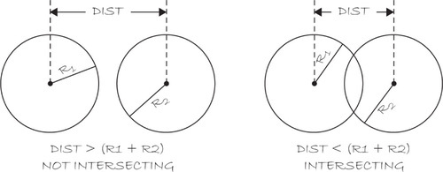

## Algorithms

* *Most* of the examples up to this point have been relatively simple. 
    * One or two major features about sketch
* As projects become more complex, you should adopt a process to prevent yourself from becoming overwhelmed. 
* *Algorithm* is defined as a procedure or formula for solving a problem. 
    * In programming this is a sequence of steps to perform a task.
* Recipes are not far off from a algorithm.

---

* Math *Algorithm*
    * Evaluate the sum of a sequence of numbers from 1 through *N*.
        * *N* can be any given whole number greater than zero.
    * `SUM(N) = 1 + 2 + 3 + ... + N`

* Algorithm:
```
1. Set SUM = 0 and a counter i = 1
2. Repeat the following while i is less than or equal to N.
    a. Calculate SUM + i and save the result in SUM.
    b. Increase the value of i by 1.
3. The solution is the value of SUM.
```

---

* Code:

```

int sum = 0;
int n = 10;
int i = 0;

while (i <= n) {
    sum = sum + 1;

    i++;
}

println(sum);

```

---

## The Process
1. Idea - Start with an Idea. (Should probably write it down)
2. Parts - Break it down into smaller parts
    1. Algorithm Psudeocode 
    2. Algorithm Code
    3. Objects - Take the data and functionality and build it into a class.
3. Integration - Take all the classes and integrate them into one larger process

---

## Ideas to parts
* As an example, let's make the rain game:

> The object of this game is to catch raindrops before they hit the ground. Every so often (difficulty can vary),
> a new drop falls from the top of the screen at a random horizontal location with random vertical speed. 
> The player must catch the raindrops with the mouse while not letting any reach the bottom of the screen.

---

* The parts:
    1. Develop a program with a circle controlled by the mouse. This is used to determine if the rain catcher as caught a raindrop.
    2. Write a program to test if two circles intersect. This will be used to if the rain catcher as caught a raindrop.
    3. Write a timer program that executes a function every *N* seconds
    4. Write a program with circles falling from the top of the screen to the bottom. These are the raindrops.

---

## Part 1: Rain Catcher
* Pseudocode:
    * Erase the background
    * Draw an ellipse at the mouse's position
  
---

* Taking it a step further and make it object-oriented
    * **Setup:**
        * Initialize the catcher object
    * **Draw:**
        * Erase the background
        * Set the catcher's location to the mouse's
        * Display catcher

---

## Part 2: Intersection
* Focus on determining if two bouncing circles intersect. The intersection function will become a part of the *Catcher* class.
* **Setup:**
    * Create two ball objects
* **Draw:**
    * Move balls.
    * If ball #1 intersects ball #2, change color of both balls to white. Otherwise leave the color gray.
    * Display the ball objects.

---

* **Data:**
    * x and y location
    * Radius
    * Speed in x and y directions.

---

* **Functions:**
    * Constructor
        * Set radius based on argument.
        * Pick random location.
        * Pick random speed.
    * Move:
        * Increment (x, y) based on speed in (x, y) directions.
        * If the ball hits an edge, reverse direction
    * Display:
        * Draw a circle at x and y locations.

---

* **Intersection**
* Determining if two objects are intersecting.
 


*Figure 10-3 (Page 189)*

---

* Assuming the following:
    * x<sub>1</sub>, y<sub>1</sub> coords. of circle one
    * x<sub>2</sub>, y<sub>2</sub> coords. of circle two
    * r<sub>1</sub> radius of circle 1
    * r<sub>2</sub> radius of circle 2

* If the distance between (x<sub>1</sub>, y<sub>1</sub>) and (x<sub>2</sub>, y<sub>2</sub>) is less than the sum of r<sub>1</sub> and r<sub>2</sub>, circle one intersects circle two.
* Put this into a function using Processing's `distance()` function.

---

## Part 3: The Timer
* Processing provides functionality to deal with time: `hour()`, `second()`, `minute()`, `month()`, etc.
* `millis()` returns the number of milliseconds since the sketch started. Can be used to calculate the amount of time that has passed.
    * *1s = 1000ms*

---

* Implementation:
    * Setup:
        * Save the time at startup (usually zero but should save anyway).
    * Draw:
        * Calculate the time passed as current time minus *savedTime*.
        * If the time passed is greater than 5,000, fill a new random background and reset *savedTime*.

---

## Part 4:
*Start here on Thursday*