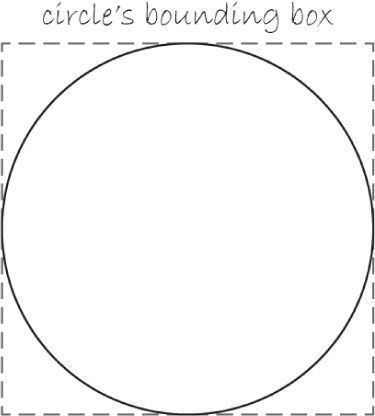
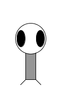

## Course Information

* [Website](https://csit.kutztown.edu/~earl/s/teaching/2020-2021/120-graph-coding)
* First Day Handout
* Tech Requirements

## Pixels

* [Graphing Paper](https://print-graph-paper.com/virtual-graph-paper)
* "Draw a line from 1,0 to 4,5"
* The Cartesian Coordinate System
* The Computer Coordinate System
    - Pixels

## Shape Representation

Based on the command (function) from the last slide,   
`line(1, 0, 4, 5)`  
think about how you could represent these in English and in code.

* Rectangle
* Triangle
* Eclipses (Circles)

## Points, Lines, Rectangles

* `point(3, 2);`
* `line(1, 2, 7, 3);`
* `rect(1, 2, 5, 4);`

## Rectangles

* By default, rectangles are specified by the coordinate for the top left corner of the rectangle,
as well as it's width and height. 
* This can be changed with the function `rectMode();`
    * *CORNER*, *CENTER*, *CORNER3*

## Eclipses

* Ellipses are similar to drawing a rectangle, except the default mode is *CENTER*  
  
* Zoomed in, ellipses may seem weird, but it isn't noticable at scale on a display.

## Other Shapes

The discussed shapes are only a subset of what processing has to offer. We'll discuss them more
in the next chapter.

## Color - Grayscale

* A pixel's location is only part of the story. You can also specify it's color.
* Grayscale: Black and White colors defined on a 256 number scale.
* 0 - Black, 255 - White.
* Any other number in between is a shade of gray.
* Colors are represented in the digital world as a byte.

## Color - Grayscale

* Computers use binary to represent colors, letters, numbers, sounds, and more.
* Binary has two possible values: 0 and 1
* Each 0 or 1 is a **bit** (**B**inary Dig**it**).
* Eight bits make up a byte.
* Think of bits as a switch (0 - Off, 1 - On)
* *0000 0000* = 0 = Black
* *1111 1111* = 255 = White

## stroke and fill

* Every shape has a `stroke();` and/or `fill();`
* Stroke is used to specify the color of an outline or line.
* Fill specifies the inner color of the shape.
* *Lines and point can only use stroke*.
* The background color can also be changed with `background();`

## stroke and fill

* The default color for `stroke();` is black and `fill();` is white.
* stroke, fill, and background are used *before* designating the shape.
* Use `noStroke();` and `noFill();` when no outline or color fill is wanted.

## Color - RBG

* Colors are created by combining red, blue, and green.
* RBG color elements also have a range from 0-255.
* Format for specifying color is `fill(red, blue, green);`.
    - `fill(255, 0, 0);` = Bright Red
    - `fill(0, 255, 0);` = Bright Blue
    - `fill(0, 0, 255);` = Bright Green

## Alpha

* There is an optional fourth component, referred to as "alpha".
* Alpha means opacity. 
* 0 means complete transparency (zero percent opaque).
* 255 is completely opaque (100 percent opaque).

## Zoog

