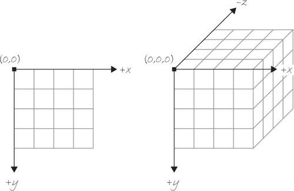
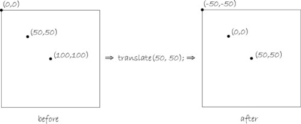

## The Z-Axis

- So far, objects have been 2D
  - Using the (x, y) cartesian coordinates
- Computer Screens, as of now, are 2D in nature
- Adding a z-axis or *depth at any given point*
- (x, y, z)
- **Example 14-1**

## 3D Plane

*Figure 14-2, Page 265*

## 3D Shapes

* Making a shape 3D, isn't as adding the z coord to an function
  * `rect(x, y, z, w, h);` wouldn't work
* `translate()`
  
## Translate

* Processing Reference
* Moves the origin point (0,0)

## Translate

*Figure 14-3, Page 265*

## Translate

* **Example 14-3**
* `translate(x, y, z)`
* Resets at beginning of *draw()*

## P3D

* Third size argument
  * *renderer* (drawing mode)
* `pixelDensity`

## Vertex Shapes

* Creation of custom shapes
* Polygon - closed shape made up of points
  * vertices
  * vertex
* `beginShape()`, `vertex(x, y)`, `endShape()`

## Simple Rotation

* `rotate(angle)` 
  * rotateX,Y,Z
  * Relative to origin location
* **Examples 14-5,-7,-8**

## Scale

* `scale()`
* Relative to origin, increase object's dimensions

## The Matrix (push & pop)

* Ability to create different "layers" 
* Static Background, Animated Movement
* `pushMatrix()`, `popMatrix()`
  * Uses a stack - *First In, Last Out*

