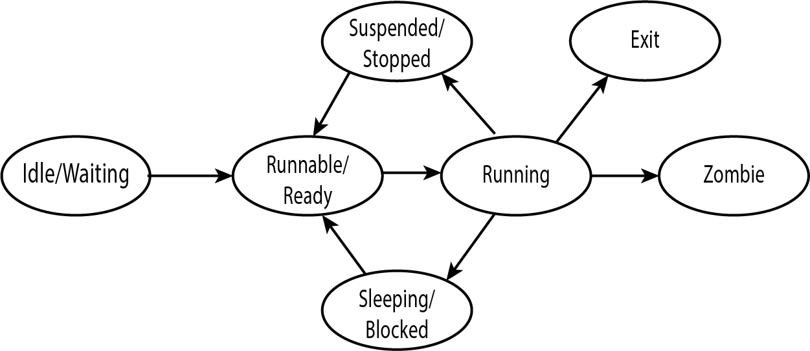

## Program Space
* Memory Space separation to protect system internals
* User(Land)
  * User Applications
  * File Utilities
* Kernel
  * stat
  * System Calls

---

## What is a process?
* Each program launched becomes a *process* until it exits
* The Kernel will manage processes
  * Assign a *process id* (PID)
  * Assign memory space
  * Accept System Calls
  * Scheduling on the processor
  * Send SIGNALs
* `ps` - View current processes

---

## UNIX Boot
* Once control is handled over the kernel, the first process is *created* (or *spawned*).
* Usually known as *init*
  * Will have *pid* of 0 or 1
* Init is responsible for launching all the processes required to run the system
  * Daemons
  * Memory Management
  * I/O Events
* All processes created could be considered *children* of init. 

---

## Parent and Children
* The two main system calls for process creation:
  * `fork()`
  * `exec()` - exec has many different forms
* The process calling `fork()` becomes the parent process
  * *PPID* - Parent Process ID
  * The newly created process is consider a *child* process
* `exec()` - Will execute an executable and replace a processes' memory space

---

## Sessions
* After successful login, a new *session* is created.
* The process that handles login, will fork and exec the user's configured shell
* `job` - Manage jobs in a session
* `&` - Send a command to the background

---

## Basic Process Commands
* history
* jobs
* kill
* fg,bg
* ps
* top
* uptime
* free
* pstree
* nohup

---

## The Process Table
* Kernel Data Structure to manage running processes
* Contains the following:
  * *Process ID*
  * *Process Owner*
  * *Process Priority*
  * *Environment Variables*
  * *Parent Process*
  * *Location of code, data, stack, and user area* (Memory Space)
  * *Pending Signals*

---

## ps command
* Useful `ps` options
  * *Different Options*
    * UNIX, BSD, GNU
  * No Arguments
  * `ps -A` or `ps -e` - Every Active Process
  * `ps -f` - Full format
  * `ps -x` - Commands ran by the user running *ps* (Usually you)
  * `ps -fu <username>` - Commands owned by another user (name or ID)
  * `ps -fG` - Commands ran by a group

---

## Daemon Process
* Typically a process running in the background *indirectly* interacting with a user.
* `daemon` in section 7 of man page
* Example Daemons:
  * `sshd`
  * `httpd`
  * `ftpd`

---

## Process Termination
* Two Ways:
  * Normal - Process Runs and Exits as planned
  * Abnormal - Termination via an external control
* `wait()`
  * Allows a parent process to *wait* until child process(es) finish
  * Parent is a *suspended* state
  
---

* Zombie Process
  * Child process that terminates, but is waiting for parent process to read it's exit status
  * Sits in Process Table
* Orphan Process
  * Parent Process Terminates before child(ren)
  * New PPID becomes *init*
  
---

## Process States

---

## Process Internals
* Scheduler
  * Algorithms to decide which process gets time on the *processor* and for how long
  * Preemptive MultiTasking - The amount of time a process runs is predetermined
* Memory Manager
  * *Virtual Memory*
* Magic Number
  * Special combo of bits near beginning of file
  * Can be used to identify it's type
  * `file`
  
---

## Process Areas
* User
  * Code Area   - The program's instructions
  * Data Area   - Data associated with program
  * Stack Area  - Program Stack (Function Calls)
  * User Area   - Misc. Stuff (Opened Files, Current Directory, etc.)
* Kernel
  * Process Table
  * Page Table
    * *Virtual Memory Table*
  * File Tables

---

## Scheduling Jobs
* crontab
* at