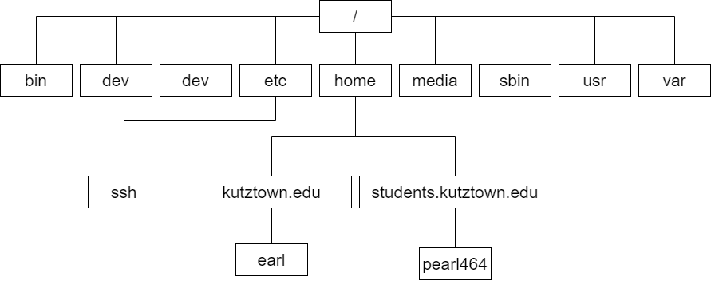
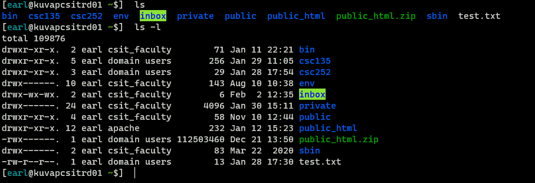

## The Filesystem

- A set of data structures that:
  - store user and system data
  - store that data as files on, usually, a disk
- Summary:
  - Organization & Terminology of the Linux Filesystem
  - Moving through the filesystem
  - Ordinary and Directory files
  - Absolute and Relative Paths
  - Important Files and Paths
  - File Access Permissions

## Hierarchical System

## Terminology

- *Directory Tree*
- *Directory Files*
- *Ordinary Files*
- ***Root***
  - Directories are connected by a path
  - *Parent* 
  - *Child*

## Filenames

- Should use these characters:
  - Uppercase Letters (A-Z)
  - Lowercase Letters (a-z)
  - Numbers (0-9)
  - Underscore (_)
  - Period (.)
  - Comma (,)
- Two files of the same name can't exist in the same directory
- Files can have the same name in *different* directories
  
## Filenames (cont.)

- Filename Extensions
- Hidden Filenames - *begin with a dot (.)*

## The Working Directory

- The directory your session is associated with
- `pwd`
- *working* or *current* directory
  
## Home Directory 

- When logging in, this is your *working* directory
- Startup Files are usually located here
  - Used to set configuration options for your shell and other programs

## Pathnames

- Files have a *pathname*
- *Absolute Pathnames*
  - `/` (root)
  - `~` (Tilde)
- *Relative Pathnames*

## Pathnames

- `.`
  - Similar to referring to the *working* directory
- `..`
  - Refers to the *parent* directory of the *working* directory

## Standard Directories and Files

- FHS
- `/bin`
- `/boot`
- `/dev/`
- `/etc/`
- `/home`/
- `/lib/`
- `/proc/`
  
## Access Permissions

`ls -l`
  