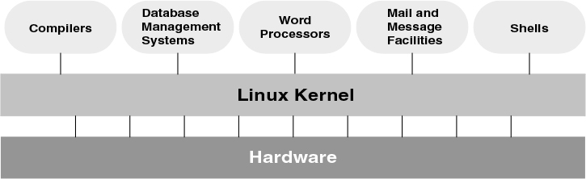
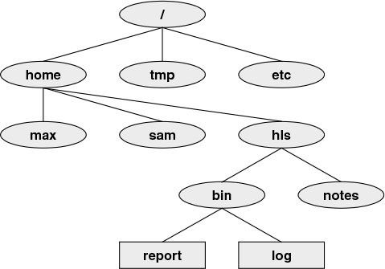

## Course Information

* [Website](https://csit.kutztown.edu/~earl/s/teaching/2020-2021/252-unix-admin/)
* First Day Handout
* Software Requirements

## History of Linux

* Zoom Breakout Rooms
* As a group, spend some time researching the history of UNIX/Linux. 
    * Introduce yourselves to each other
    * Find one interesting fact about the history of UNIX to share with the class.
    * 15 minutes. 

## Before Linux: UNIX

* UNIX was created out of a need to share selected data and programs.
* Also needed to keep other information private.
* Developed by Bell Labs and widely adopted in 1975.
* Universities adopted it for use in their CS departments
    - Students became acclimated to it.
    - Gained adoption in industry because of graduates with the skills
    - "The four-year effect"

## Other Major Versions

* University of California at Berkeley
    - Computer Systems Research Group (CSRG) made many additions to UNIX.
    - New version known as Berkeley Software Distribution (BSD).
* UNIX System V (SVR4)
    - Descended from versions developed and maintained by AT&T (Formerly Bell Labs)

## GNU Project

* Started by Richard Stallman in 1983
* GNU Project was meant to create a *free* OS (kernel and system programs)
    - GNU: Stands for Gnu's Not UNIX.
    - "...is the name of the complete UNIX-compatible software system which I am writing so that I can give it away free to everyone who can use it."

## Linux Kernel

* Created by Linus Torvalds, as a Finnish undergraduate. 
* Version 0.01 released September 1991
* Linux = *Linus* + *UNIX*
* The Kernel's source code is *free* and *open source*
    - [Github](https://github.com/torvalds/linux)

## Computer Hardware

* CPU
* RAM
* Storage Space 
    - HDD
    - SSD
* Media
    - DVD Write/Read
    - Flash Drives

## Computer Hardware (continued)

* Accessories
    - Printers
    - Mouse
    - Keyboard
    - Monitor
    - Controllers
* Network Interfaces

## What's so special?

* Standards
* Applications
* Peripherals
* Software
* Platforms
* Emulators
* Virtual Machines

## Linux's Popularity

* *Generic* - Can run on almost any type of hardware, making it portable
* Use in Embedded Devices
    - Phones
    - Routers
    - TVs

## Linux Structure

* Kernel
    * Provides a programming interface
    * Manages a system's resources
    * Programs interact with the kernel via *system calls*.
* Multi-user Support
    * Linux can support between 1 to 1,000 users concurrently.
    * *Depending on the hardware*

## Kernel

*Figure 1-1 in Textbook*

## Linux Structure 

* Supports multiple jobs
    - Users can run more than one "job" at a time.
    - Known as ***processes***
* File Structure
    - Hierarchical Filesystem
    - Information is stored in files
    - Files have a unique identifier on the storage device.
    - Linux Filesystem Hierarchy Standard (FHS)

## Linux Structure 

* File Structure (more)
    - Links allowing for files to have two or more "names."
    - Security: Access to files can be controlled

## Linux Structure

*Figure 1-2 in Textbook*

## The Shell

* An interface between you and the operating systems
* Better known as a command interpreter. 
* You enter a command, the shell interprets the command, and calls the program you want.

## The Shell
* Four Popular Shells:
    - bash (Bourne Again Shell)
    - dash (Debian Almquist Shell *smaller version of bash*)
    - tc (Enhanced version of the c shell, from BSD UNIX)
    - zsh - (Z Shell, combination of features from other shells)

## The Shell
* Shell Scripts
    - Commands arranged in a file for later execution
* Completion - Shell will provide autocompletion of
    - commands
    - filenames
    - pathname
    - variables
    - Press *TAB* to use.

## Useful Utilities

* Hundreds of *utility* programs
    - aka *commands*
    - Command presentations

