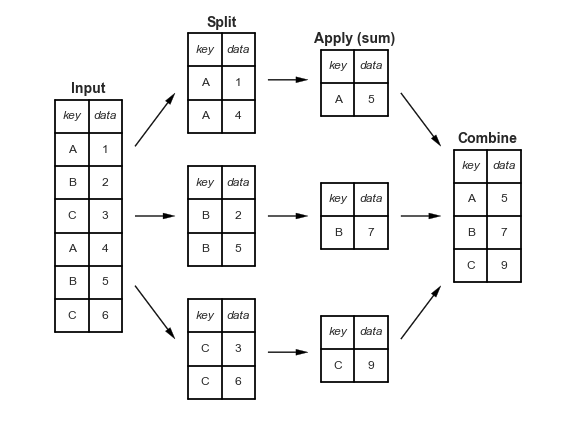

# **Pandas - Grouping Data**

CSC223 - Advanced Scientific Programming

Prof. Patrick Earl

Spring 2022

---

## Aggregation
- An effective method for getting summarization information about large datasets. 
- Aggregations (i.e. sum, mean, min) reduce data to a single number and may provide insights when performing data analysis. 
- Pandas has built-in methods for computing these aggregations.

---

## Simple Aggregations
- Pandas `Series` are going to return single values like numpy arrays.
  
```
rng = np.random.RandomState(42)
s1 = pd.Series(rng.rand(5))
s1
```
- Aggregations on these random values:
```
s1.sum()
s1.mean()
s1.min() # .max()
```

---

- These can also be used on Pandas `DataFrame` objects. By default aggregates return results within a column
  
```
df = pd.DataFrame({'A': rng.rand(5),
                   'B': rng.rand(5)})
df
```
- Aggregation functions on the random values:

```
df.mean()
df.mean(axis='columns') # or axis=1
```
---

## Summarization
- The `describe` method provides common aggregations
  - *count, mean, std, min, 25%, 50%, 75%, max*

```
df.describe()
```

---

## Other built-in methods
| Aggregation | Description |
| -- | -- |
| `count()` | Total number of items |
| `first()`, `last()` | First and last item |
| `mean()`, `median()` | Mean and median |
| `min()`, `max()` | Minimum and Maximum | 
| `std()`, `var()` | Standard Deviation and Variance | 
| `mad()` | Mean Absolute Deviation | 
| `prod()` | Product of all items | 

---

## GroupBy
- Simple aggregation of data is usually not enough to do effective analysis. 
- `groupby` allows for computing aggregates on subsets of data.
  - The name comes from a similar feature available with SQL.
- `groupby` works in 3 parts:
  1. Split - Breaking up and grouping a `DataFrame` on the value of a specific key.
  2. Apply - Computing some function (aggregate, transformation, or filtering) within the individual groups
  3. Combine - Merge the results of these operations into an output array

---


-*From Section on Aggregation and Grouping in DSH*

---

## Using GroupBy

```python
df = pd.DataFrame({'key': list('ABCABC'),
                    'data1': range(6),
                    'data2': range(5, 11)})
df

df.groupby('key')
```

---

- Note that this only returns a `DataFrameGroupBy` object. 
  - This is a special abstract view of the DataFrame. 
  - Aggregates can be applied to this
- The key becomes the new index

```python
df.groupby('key').sum()
```

---

## Applying functions to a groupby object
- `GroupBy` objects have the following methods available:
  - `aggregate()`
  - `filter()`
  - `transform()`
  - `apply()`

---

## GroupBy - Aggregate
- The aggregate can be used to do multiple aggregates at once
  - Taking a string, function, or list.

```python
df.groupby('key').aggregate(['min', np.median, max])
```

- Dictionary mappings can be used to apply an operation to specific columns

```python
df.groupby('key').aggregate({'data1': 'min', 'data2': 'max})
```

---

## GroupBy - Filtering
- Allows for grouping based on the group's properties. 
- The `filter` method takes a function that returns a Boolean value

```python
def filter_func(x):
    return x['data1'].std() > 2

df.groupby('key').filter(filter_func)
```

---

## GroupBy - Transformation
- Transformations returns a transformed version of the full data. The output will have the same shape as the input
- Centering data by subtracting the group-wise mean:

```python
df.groupby('key').transform(lambda x: x - x.mean())
```

---

## GroupBy - Apply
- `apply()` allows you to apply an arbitrary function to the group results.
- As an example, this apply will normalize the first column by the sum of the second.

```python
def norm_by_data2(x):
  x['data1'] /= x['data2'].sum()
  return x

df.groupby('key').apply(norm_by_data2)
```

---

## Specifying the split key
- More than one key can be used to group the data.
- The key can be any series or list that matches the length of the `DataFrame`.

```python
L = [0, 1, 0, 1, 2, 0]
df.groupby(L).sum()
```

- Or a dictionary that maps index values to a group key

```python
df2 = df.set_index('key')
mapping = {'A': 'vowel', 'B': 'consonant', 'C': 'consonant'}
df2.groupby(mapping).sum()
```

---

- A Python function can be used

```python
df2.groupby(str.lower).mean()
```

- Any of these keys can be combined to group on a mutli-index

```python
df2.groupby([str.lower, mapping]).mean()
```
