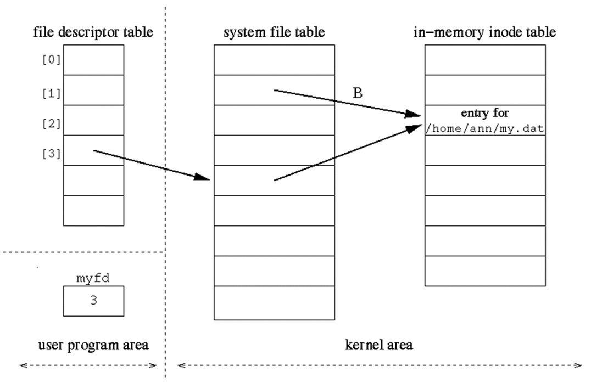

# **The Filesystem**

CSC252 - UNIX Scripting & Administration

Prof. Patrick Earl

Spring 2022

---

# A Hierarchical System

---

# Filesystem Hierarchy Standard

- A standard structure for what directories should be created and their purpose. 
- Used as a guide so that OS & software creators can have a general idea on where items are located.
- [Maintained by the Linux Foundation](https://refspecs.linuxfoundation.org/FHS_3.0/fhs/index.html)

---

# Directory and Ordinary Files

- **Ordinary File** - Appears at the end of a filepath where there are no more branches
  - Simply a file. 
  - Different types of files
- **Directory File** - Appears at the end of a filepath, but can be branched into. 

---

# Special Directories

- **Working Directory** - When in command-line environments, you will always be in an associated directory. 
- **Home Directory** - Your working directory when first logging into a command-line environment.
  - Typically used to hold `start-up` files.

---

# Pathnames

- a.k.a file paths
- **Absolute** 
- **Relative** 

---

# Filesystem Commands

- `ls`
- `cd`
- `mkdir` / `rmdir` / `rm -r`
- `mv`
- `cp`

---

# Special File Types

- `info ls`

---

# Long Listing Format

- `ls -l` Long Format
- Displays the following information:
  - File Type
  - File Mode Bits
  - Number of Hard Links
  - Owner Name
  - Group Name
  - Size
  - Timestamp (Modification)
  - File Name

---

# File Permissions

- Every user *can* have the following three permissions on a given file:
  - Read - The user can view the contents of the file
  - Write - User can write to the file
  - Execute - User can execute the file (This can mean different things depending on file type)

- These 3 permissions are put into three groups:
  - Owner
  - Group
  - Other

---

# `chmod`

- Command used to change the permission bits for files
- Symbolic vs Numeric (Octal)
  - `chmod u+rw file1.txt`
  - `chmod 600 file1.txt`
  - 1 - Execute
  - 2 - Write
  - 4 - Read

---

# Special File Permissions

- `setuid` - Process runs with the file's owner
- `setgid` - Process runs with the group owner of file
- `sticky` - Protects files within a directory. File can only be deleted by owner of file, directory, or root. 

---

# Changing File Attributes

- `chown`
- `chgrp`
- `touch`

---

## Links

- Refer to the same data by using two filenames
- Two Types:
  - Hard
  - Symbolic (File Type: `l`)
- `ln`

---

## Storage & Devices

- **Drivers** - Communicating with hardware
  - Part of the Kernel (In most cases)
- `ls -l` on devices
  - Major & Minor Numbers
  - The driver being used by the Kernel
- Most common types of storage protocols:
  - SCSI/SATA/SAS

---

## Device Types

- Character Devices
  - Accessed as a stream of sequential data
  - Keyboard Devices, Serial Ports
- Block Device
  - Hardware device that contains *blocks* of data
  - Buffering is required
  - Hard Disks, SSDs, USB Flash Drives, etc.

---

## Hard Disks

- Platters
- Read/Write Head
- Tracks
  - Cylinder
- Sectors & Blocks
- Source: [Hard Disk Drive Basics](https://www.ntfs.com/hard-disk-basics.htm)

---

## Storage Partitions

- Linux File Structure can be split into three layers
  - Filesystem, Partition, Physical
- Partitioning - Logically splitting a physical drive into smaller parts
  - MBR vs GPT
- `fdisk`
- `lsblk`
- **ext4** - Fourth Extended Filesystem

---

## Index Nodes (inode)

- Unique Identifier for metadata 
  - Contains metadata for a given filename
    - The Mode/Permissions
    - Owner ID, Group ID
    - Size of the File
    - Number of Hard Links
    - Time Accessed, Modified 
    - Time inode modified
    - Location of data blocks

---

## Data Blocks

- Where the actual contents of the file are stored
- Files are just a collection of these blocks

--- 

## File Table

*Image Source:* Dr. Lisa Frye

---

# **Logical Volume Manager (LVM)**

- Tool for logical volume management which includes allocation of disks, striping, mirroring, and resizing of logical volumes
- A logical volume can exist across different physical volumes

---

# **RAID**

- **R**edundant **A**rray of **I**ndependent **D**isks
  - Some people will say the **I** stands for Inexpensive.
- An alternative to LVM, combine physical drives to get a larger disk capacity.
- RAID Levels

--- 

# **Resources**

- [UEFI & GPT](https://wiki.restarters.net/UEFI_and_GPT)
- [EXT2 Superblock](http://www.science.unitn.it/~fiorella/guidelinux/tlk/node97.html)
- [Red Hat Documentation on LVM](https://web.mit.edu/rhel-doc/5/RHEL-5-manual/Deployment_Guide-en-US/ch-lvm.html#)
- [ext4 information](<https://www.kernel.org/doc/html/latest/filesystems/ext4/index.html>)
- [SAS (Serial Attached SCSI)](https://en.wikipedia.org/wiki/Serial_Attached_SCSI)
- [What is RAID?](https://raid.wiki.kernel.org/index.php/What_is_RAID_and_why_should_you_want_it%3F)