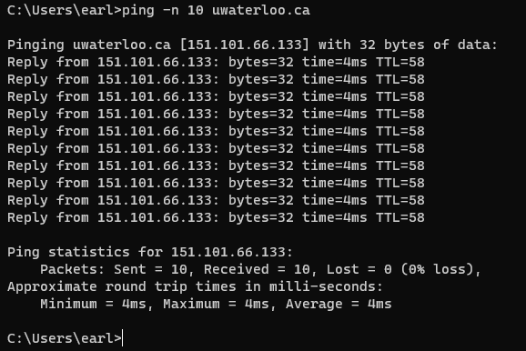
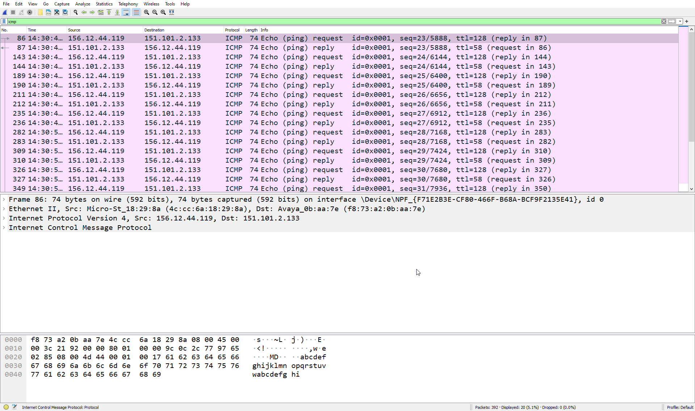
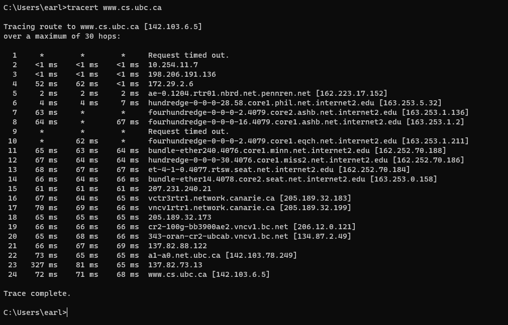
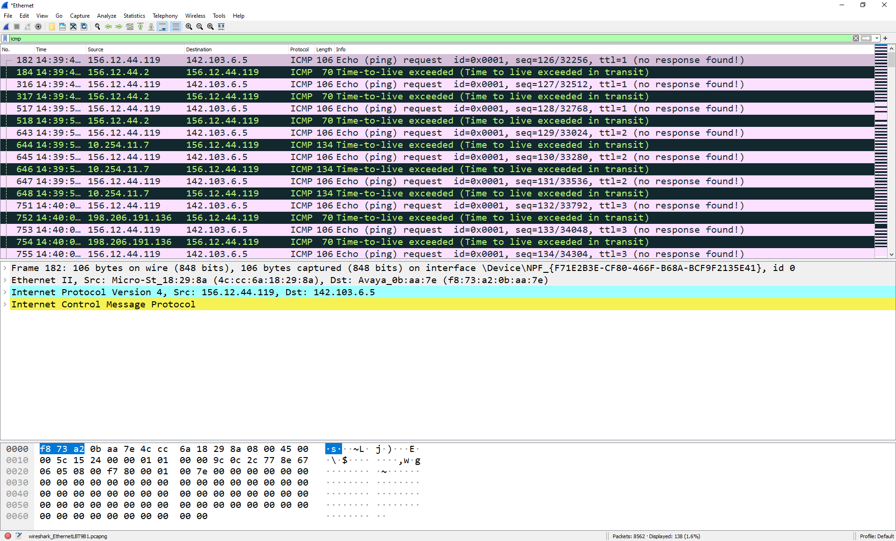

title: ICMP Wireshark Lab
breadcrumb: ../index.md

**Due:**
: Friday November 12, 11:59PM.

You'll be capturing ICMP packets in Wireshark and analyzing them for this assignment. 
Specificity we'll be looking at:

* ICMP Messages generated by the *Ping* program;
* ICMP Messages generated by the *Traceroute* program;
* the format and contents of an ICMP message.

## Submission
Follow the directions in the sections below. Record the answers with the requested screenshots
for each section. 

Submit your completed document on D2L in `.docx` or `.pdf` format. 

## Section 1: ICMP and Ping
To start we'll explore ICMP packets created by *ping*. Ping exists on every major operating system and
is used to verify if a host is alive or not. The ping program will send a packet to a target IP address.
If the target machine is alive, the target host responds back by sending a packet back. Let's 
explore this interaction.

Do the following:

* Open a Windows Command Prompt (or terminal if on Linux/Mac). 
    * Search `cmd` in your Windows search bar.
* Start up Wireshark and begin your packet capture.
* Go back to your terminal/command prompt and use the ping command. The ping command uses this general format:
    * `ping *hostname*`, where *hostname* is the target machine you want to check. (Without the stars(\*))
* For your lab, ping the web server for *University of Waterloo* 10 times: `ping -n 10 uwaterloo.ca`
    * The `-n 10` tells ping to send 10 requests instead of the 4 that happen by default. 
* Once the Ping program stops, stop packet capture in Wireshark.

Assuming you did everything correctly, you should see something similar to the screenshot below. In
this image, the source Ping program is located in Kutztown and the target is in Ontario, Canada. For
each packet, the source will calculate round trip time (RTT). 

**Figure 1** Command Prompt window after running the ping program.

In Wireshark, apply a display filter for the *icmp* protocol. My Wireshark capture from the 
ping command above looks like this:

**Figure 2** Wireshark window after capturing the ICMP packets from the ping program above.

*For this section only include a screenshot of the ICMP request and ICMP response you use to
answer these questions*

Answer the following questions:

1. What is the IP address of your host? What is the IP address of the destination host?
2. Why is it that an ICMP packet does not have source and destination port numbers?
3. Examine one of the ping request packets send by your host. 
    1. What are the ICMP type and code numbers?
    2. What other fields does this ICMP packet have? 
    3. How many bytes are the checksum, sequence number, and identifier fields?
4. Examine the corresponding ping reply packet.
    1. What are the ICMP byte and code numbers?
    2. What other fields does this ICMP packet have? 
    3. How many bytes are the checksum, sequence, and identifier fields?

## Section 2: ICMP and Traceroute

The *traceroute* program also uses ICMP to figure out the path a packet could take from source
to destination. Traceroute is implemented differently in UNIX/Linux and in Windows. When UNIX is 
the source, it will send a set of UDP packets to an unlikely destination port number. For Windows 
source machine, it will send a set of ICMP packets. The similarity is the use of the TTL value.
The first packet set will be `TTL=1`, second `TTL=2`, and so on. Remember that routers will
decrement a packet's TTL value as it passes through. When a packet with a TTL value of 1 arrives 
at a router, it will send an ICMP error packet back to the source machine. 

Do the following:

* Again open your Windows Command Prompt (or terminal if on Mac/Linux).
* Start up Wireshark and begin packet capture. 
* In Windows the traceroute command is `tracert`. Mac/Linux it should be `traceroute`. 
    * *NOTE:* Traceroute might not be installed on your Mac/Linux machine. If you need help installing it, contact me.
* The syntax for the command is `tracert *hostname*`. Where again *hostname* is the target machine you want to trace too. 
* Do a traceroute to the web host for the *University of British Columbia's* Computer Science department. 
    * `tracert www.cs.ubc.ca`
    * *NOTE:* If you get a couple of hops that "Request Time out.", it's fine. Keep the trace going until the end.
* Once the traceroute ends, stop the packet capture in Wireshark.

Your program should produce an output similar to the one below. For this screenshot, the source
machine is located in Kutztown, PA and the target is is Vancouver, BC. For each TTL,
the source sends three probe packets. Traceroute displays the RTT for each of the probe packets,
as well as the IP address (or hostname) of the router that returned the ICMP TTL-exceeded message.

**Figure 3** Command prompt window after running the traceroute command

Again apply the `icmp` protocol filter to your Wireshark capture. You should see something similar to
figure 4.

**Figure 4** Wireshark packet capture for traceroute command.

For this section include a screenshot of your command prompt output. Also include the screenshots
as specified below. 

Answer the following questions:

1. What is the IP address of your host? What is the IP address of the target destination host?
2. If traceroute sent UDP packets instead (as in Unix/Linux), would the IP protocol number still be 01? If not, what would it be?
3. Pick an ICMP echo packet. Include a screenshot of the packet details for the packet you choose.
    1. Is this different from the ICMP ping query packets in the first half of this lab? If yes, how so?
4. Pick an ICMP error packet. Include a screenshot of the packet details for the packet you choose.
    1. IT has more fields than the ICMP echo packet. What is included in those fields?
5. Examine the **last** three ICMP packets received by the source host. 
    1. How are these packets different from the ICMP error packets?
    2. Why are they different?
6. Within the tracert measurements, is there a link (hop) whose delay is significantly longer than others?
7. In **Figure 4**, is there a link (hop) whose delay is significantly longer than others?

That's all folks!

**Acknowledgment:**
: This Wireshark lab is adopted from the ICMP Wireshark Lab created by J.F. Kurose and K.W. Ross
from their textbook *Computer Networking: A Top-Down Approach*