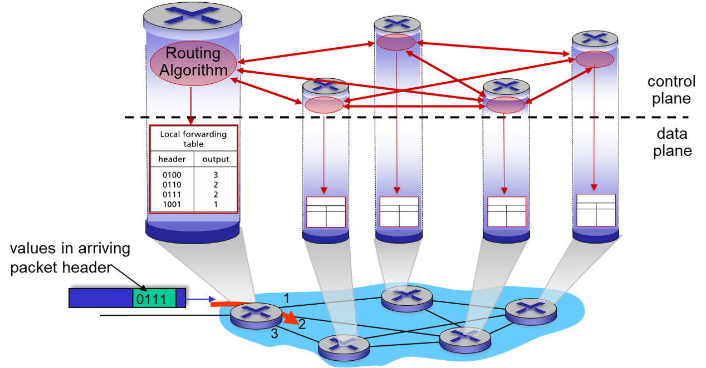
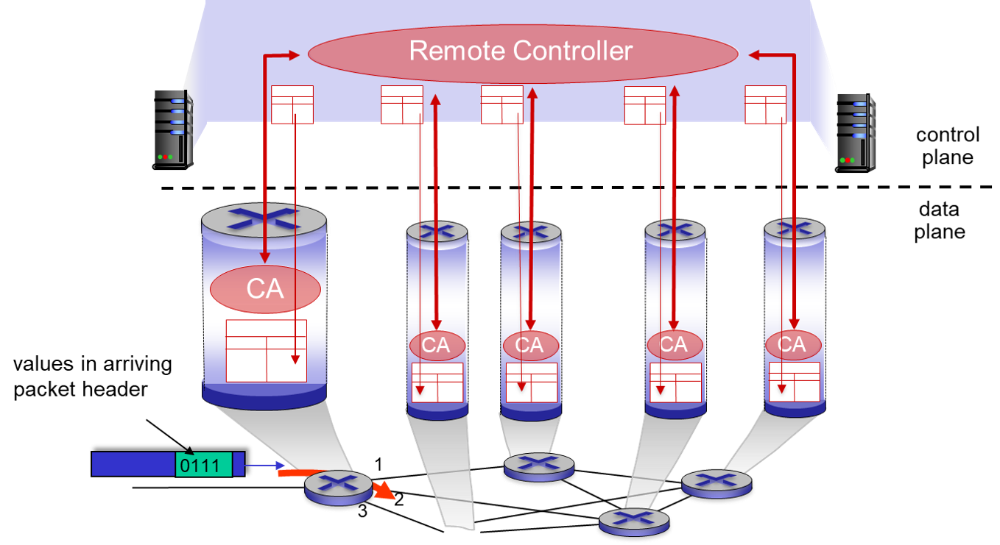

## Control Plane Overview
* These slides are adopted from the Chapter 5 slide deck.
* We're going to skip over most of the concepts in the control plane and focus on these:
    * ICMP
    * BGP
    * Some guiding principles

---

## The Network-Layer Functions
* Forwarding: Move packets from router's input link to appropriate output link (Data)
* Routing: Determine route taken by packets from source to destination (Control)
* The two approaches:
    * Per-Router
    * Logically Centralized Control (SDN)
    * *More on this in a bit*

---

## Error Reporting: ICMP
* **ICMP:** Internet Control Message Protocol
* Used by hosts and routers to communicate network-level information. 
    * Error Reporting: Unreachable host, network, port, protocol, etc.
    * Echo reply/request (**Ping**)
* ICMP packets are encapsulated inside IPv4 packets
    * The format of the header depends on the type, the first 8 bytes are fixed. 
    * *Type*, *Code*, *Checksum*, *Rest of Header*

---

## ICMP - Traceroute
* Source sends UDP segments to destination
  * Increase the TTL for each hop.
  * *1st segment = 1 TTL*
  * *2nd segment = 2 TTL*
  * *nth segment = N TTL*
* Causes an ICMP error. When the message arrives back at the host, records the RRT

---

## Per-Router

---

## Software Defined Networking

---

## Routing: Overview
* **Goal:** Determine "good" paths from sending hosts to receiving host, through a network of routers.
    * *Path:* The sequence of routers that a packet transverse. 
    * *Good?*

---

## Routing Among ISPs: BGP
* TODO