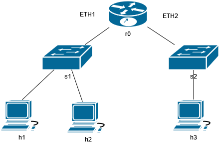

title: Basic Network Simulation
breadcrumb: ../index.md

**Due:**
: Friday, April 8th by 11:59PM

# Description

## Subnetting

You are going to simulate a basic network. You'll need to assign the IP addresses by subnetting
the IP address blocks below using CIDR. 

The following figure shows an example of how the network is structured:

Routers are responsible for directing traffic between various logical networks. This network
has two networks which you'll have to subnet. The first router interface (**ETH1**) is connected
to *s1* which is connected to *h1* & *h2*. The second router interface (**ETH2**) is connected to
*s2* which is connected to *h3*. 

These are the CIDR network block assignments:

* **Network 1 (ETH1)** - 205.16.0.0/26
* **Network 2 (ETH2)** - 118.25.24.0/27

You'll need to figure out the usable IP addresses for hosts. 
The first host IP address should be assigned to the router interface for each respective network. 

The remaining addresses should be assigned to the hosts in the network (h1 & h2 in network 1, h3 in network 2).

## Simulating

To confirm that your addressing works, you'll be using the mininet simulator. Start the virtual machine
you created early in the semester. You will download a premade Python script which has the network
topology defined for you. All you'll have to do is assign your IP addresses to variables in the script.

Follow these steps:

1. Turn on the virtual machine
2. SSH into the VM once it's started. 
3. Download the script for this assignment using this command:
    1. `wget https://faculty.kutztown.edu/earl/teaching/2021-2022/411-adv-comp-network/hw/assign3_code.txt`
4. Rename the script using the following command:
    1. `mv assign3_code.txt assign3.py`
5. Make the script executable:
    1. `chmod +x assign3.py`

The provided script has sample IP addresses filled in to test it. You should be able to access
the mininet CLI by running this:

`sudo -E ./assign3.py`

You'll be placed into the mininet CLI (The prompt should be `mininet>`). Test that the script
successfully runs by doing a ping: `h1 ping h3`. If you see responses the script is working. You can 
type `exit` to go back to the bash prompt. 

Edit the script using `nano` or whatever text editor you're familiar with. Inside the script
edit the section labeled "STUDENTS". You'll put the IP addresses you figured out earlier in their 
respective places. Save your changes and run the mininet environment using the same command from above. 

Test that your assignments work by doing the following in the mininet prompt:

1. `h1 ping h2`
2. `h1 ping h3`

Take a screenshot of the command output from the two commands above AND of the `dump` & `net` commands
in the mininet prompt. 

Once done you can exit the mininet prompt and shutdown the VM. 

### Submission:

You'll submit the following in a PDF or Word Document. Be sure to place your name at the top
of the document. 

1. Your subnetted networks. Give me the address block and valid host IP addresses. (Similar to the previous assignment).
2. Screenshots of the following from the mininet prompt:
    1. Output of the `h1 ping h2` command.
    2. Output of the `h1 ping h3` command.
    3. Output of the `dump` command.
    4. Output of the `net` command.

Send your completed document to the instructor's email address.
