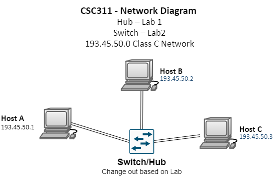

title: CSC311 Labs

## Lab Objectives

* Understand behavior of a Hub vs. Layer-2 Switch.
* Understand impact of various link parameters (Bandwidth, End-to-End Delays)

## Description

Recreate the network featured in the diagram below. Your network will be made up of
3 hosts and a hub (or switch depending on the lab). The three hosts will be connected to the
hub via ethernet. 

Addtionally, explore if these programs have these features:  

* Allow for creation of addtional traffic, to introduce queuing delays
* Changing of the link parameters:
    * Bandwidth
    * Distance between devices
* Packet monitoring with Wireshark or equivalent. 

## Deliverables

* Exports of the labs from PT & GNS3
* Solution Manual for completing the lab(s). - Collaborative

