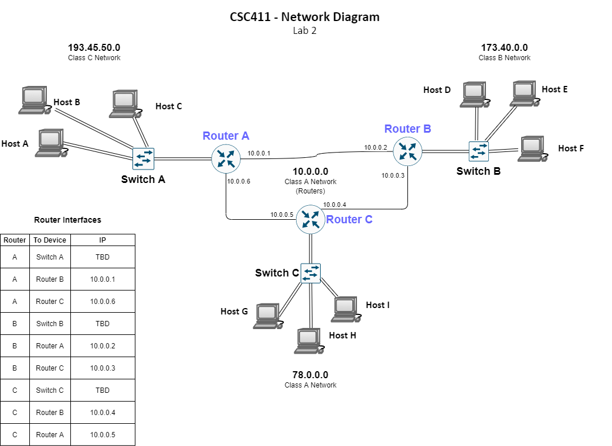

title: CSC411 Lab #2

## Lab Objectives

* Design and Implement addressing scheme (subnets/CIDR)
* How routing tables effect traffic

## Description

Recreate the network shown in the diagram below. There will be three networks, each with at least two hosts, a Layer-2 switch, and an edge router. All edge routers should be connected to each other.

Three class-full IP blocks have been provided. Figure out the 
network, broadcast, and host addresses for each network. 
*Use the first available IP address on the interface connecting the router to the switch.*

The fourth class A network is used for addressing the connected routers. The IP addresses to be used for the interfaces connecting the routers has been provided. 

A routing table will be provided upon figuring out the IP addresses for the three networks.

* Network A:
    - **193.45.50.0 Class C Network**
    - 3 Hosts (A, B, C)
* Network B:
    - **173.40.0.0 Class B Network**
    - 3 Hosts (D, E, F)
* Network C: 
    - **78.0.0.0 Class A Network**
    - 3 Hosts (G, H, I)
* Network D (Router Connections)
    - **10.0.0.0 Class A Network**
    - Use IP addresses provided on the router interfaces

## Deliverables

* Individual exports of the finished labs from PT & GNS3.
* Collaborative Solution Manual for completing the lab 

