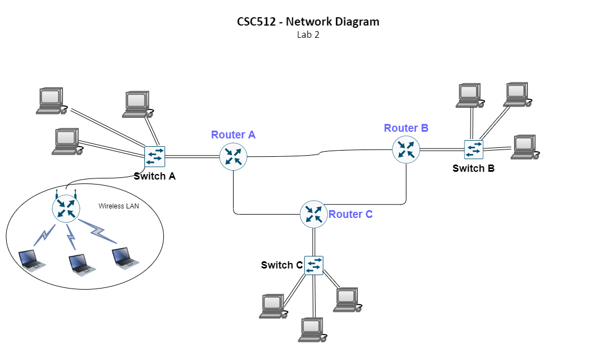

title: CSC512 WLAN Lab

## Lab Objectives

* Add a wireless network to an existing wired network
* Integrate NAT to support the new WLAN

## Description

Using your previous lab (IS: CSC411 Lab 2), add a wireless access point and at least three wireless
devices to *Network A*. You'll need to configure the AP to support NAT as the networking scheme
for the WLAN should use a private IP address. The AP should work as a DHCP server as well. This may
require some independent research to figure out how it'll work. 

A reference network diagram has been provided below:

## Deliverables

* Individual exports of the labs from packet tracer and GNS3. 
* A collaborative solution manual to solve the lab in both GNS3 & packet tracer. 
    * Outline any pitfalls you experienced with trying to setup a wireless access point. 